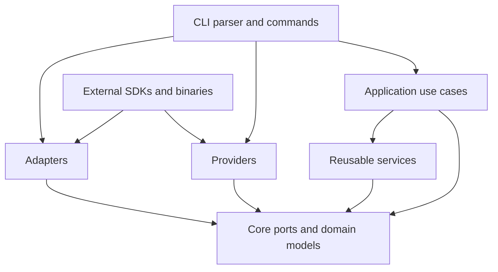

# Architecture and Test Report

**Project:** `edge-tts-cli`
**Report date:** 2026-08-27
**Python:** `>=3.10`
**Version:** `1.0.0`

## 1. Executive Summary

`edge-tts-cli` is a Python CLI for converting text and subtitle files into numbered audio/subtitle projects. The current design separates command-line concerns, application workflows, domain contracts, reusable services, external providers, and I/O adapters.

The architecture is prepared for multiple engines and media workflows:

- Edge TTS is the default text-to-speech provider.
- Google Cloud Text-to-Speech is an optional provider.
- Whisper is an optional speech-to-text provider for audio/video transcription.
- FFmpeg/FFprobe are used by the media adapter for video/audio processing.
- Output formats currently include MP3, SRT, VTT, and JSON.

The latest verified test run completed with **67 passed tests**. Source compilation also completed successfully.

## 2. Architectural Goals

The project architecture is designed around these goals:

1. Keep application workflows independent from a specific TTS or STT vendor.
2. Make provider integrations replaceable through protocol-based ports.
3. Keep CLI wiring in one composition root.
4. Isolate filesystem, subtitle, console, and output-format concerns in adapters.
5. Centralize reusable policies such as retry, cleanup, project numbering, and batch discovery.
6. Make provider/network behavior testable offline through mocks and fakes.

## 3. Layered Architecture



### Dependency rules

```text
cli -> application, providers, adapters, services, core
application -> services, core
services -> core
providers -> core
adapters -> core
core -> no project-specific outer layer
```

The `core` layer does not depend on providers or adapters. The application layer receives dependencies through constructors and works against interfaces rather than concrete vendor classes.

## 4. Package Responsibilities

### `src/tts_cli/core`

Framework-independent domain contracts and models:

- `interfaces.py`: ports such as `TTSEngine`, `SpeechTranscriber`, `OutputPort`, `ProgressPort`, and `RetryPort`.
- `models.py`: configuration and result models such as `TTSConfig`, `TranscribeConfig`, `SynthesisResult`, `TranscriptResult`, `SubtitleCue`, and `OutputContext`.
- `config.py`: command validation and configuration rules.
- `errors.py`: public application errors, including `RetryExhaustedError`.
- `constants.py`: shared constants.

### `src/tts_cli/application`

Use cases that coordinate user workflows:

- `SynthesizeUseCase`: normalize input, synthesize audio, build subtitle cues, and write selected outputs.
- `BatchProcessUseCase`: discover files, process them in order, skip complete projects, and report progress.
- `TranscribeUseCase`: transcribe audio/video and write an SRT result.
- `VoiceListingUseCase`: query and display available voices.

Use cases accept their collaborators through constructors. The application layer does not instantiate a concrete provider internally.

### `src/tts_cli/services`

Reusable policies and orchestration:

- `RetryExecutor`: retry and timeout handling while preserving the original exception as `cause` and `__cause__`.
- `ProjectService`: numbered project paths and project lifecycle behavior.
- `BatchFileService`: sorted discovery of TXT, SRT, and VTT input files.
- `TranscriptionService`: media extraction and transcription coordination.
- `VoiceCatalogService`: voice filtering and catalog behavior.

### `src/tts_cli/providers`

External service and tool integrations:

- TTS providers and factory: Edge TTS and optional Google Cloud TTS.
- STT providers and factory: Whisper transcription.
- Media integration: FFmpeg/FFprobe access.
- Voice catalog integration for provider voice loading.

Providers implement core ports and contain vendor-specific SDK behavior.

### `src/tts_cli/adapters`

Input/output and presentation implementations:

- Input adapters resolve direct text, TXT, SRT, VTT, and media input.
- Output adapters resolve and write MP3, SRT, VTT, and JSON artifacts.
- Subtitle adapters parse and format subtitle cues.
- Console adapters render progress and CLI output.

`OutputFormatPort` is defined in `core` and implemented by the concrete output handlers, so `OutputResolver` can satisfy `OutputPort` without exposing adapter-only types to application code.

### `src/tts_cli/cli`

The CLI boundary:

- `parser.py`: argument definitions and subcommands.
- `commands.py`: composition root that creates concrete providers, services, adapters, and use cases.
- `__main__.py`: process entry point, error presentation, and exit status handling.

## 5. Main Workflows

### Text-to-speech generation

```text
CLI arguments
  -> InputResolver
  -> SynthesizeUseCase
  -> text normalization
  -> TTS provider through TTSEngine
  -> RetryExecutor
  -> subtitle cue generation
  -> OutputResolver
  -> numbered project folder
```

Default artifacts are `audio.mp3` and `subtitle.srt`. The `--formats` option selects any supported combination of `mp3`, `srt`, `vtt`, and `json`.

### Batch processing

```text
source directory
  -> BatchFileService.discover()
  -> sorted input files
  -> per-file input resolution
  -> SynthesizeUseCase
  -> numbered output folders
```

Batch behavior:

- Files are processed in sorted order.
- Project numbering starts at `--start`.
- `--skip-existing` checks the files required by the selected formats.
- `--continue-on-error` controls whether an item failure is logged and processing continues.
- Progress is finalized in a `finally` block.
- `KeyboardInterrupt` and cancellation exceptions are not swallowed by the per-file `except Exception` handler.

### Audio/video transcription

```text
media source
  -> media type validation
  -> FFmpeg audio extraction when needed
  -> STT provider through transcription port
  -> SRT writer
```

Whisper is optional and runs locally. Video input requires FFmpeg to extract an audio track.

## 6. Error and Retry Design

`RetryExecutor` retries a failed operation according to configured retry and timeout values. When all attempts fail, it raises `RetryExhaustedError` with:

- `attempts`: number of attempts performed;
- `cause`: original exception object;
- `__cause__`: Python exception chaining to the original failure.

`RetryExhaustedError` also inherits from `RuntimeError` for compatibility with existing callers. The CLI unwraps this error when selecting a user-facing hint for timeout and connection failures.

Output and project operations clean up incomplete artifacts when a synthesis or output-writing operation fails.

## 7. Test Report

### Test environment

- Test runner: `pytest`
- Execution environment: project virtual environment at `venv`
- Network behavior: Edge TTS calls are mocked; the suite is designed to run offline.
- Optional Google Cloud and Whisper integrations are covered without requiring live provider calls in the default suite.

### Test coverage by area

| Area | Test module(s) | Covered behavior |
| --- | --- | --- |
| CLI parsing and entry behavior | `test_cli.py`, `test_commands.py` | Commands, options, shortcuts, exit/error behavior |
| Argument validation | `test_validation.py` | Invalid combinations and configuration values |
| Text input | `test_text.py` | TXT/SRT/VTT reading and text normalization |
| Subtitle processing | `test_subtitle.py` | Cue construction and SRT formatting |
| TTS engine/provider behavior | `test_edge_tts_engine.py`, `test_providers.py` | Provider calls, voice/config mapping, provider boundaries |
| Synthesis and retry | `test_services.py`, `test_errors.py` | Retry recovery, exhaustion metadata, cleanup, output dispatch |
| Batch processing | `test_services.py` | Discovery, ordering, continue/stop behavior, skip-existing, progress cleanup |
| Output handling | `test_output.py` | MP3/SRT/VTT/JSON handlers and cleanup |
| Transcription | `test_transcribe.py` | Audio/video flow and subtitle output |
| Voice catalog | `test_voices.py` | Language, gender, and search filtering |

### Verification results

Commands executed:

```powershell
venv\Scripts\python.exe -m pytest tests -q
venv\Scripts\python.exe -m compileall -q src
```

Results:

```text
67 passed in 0.99s
compileall: passed with no errors
```

Focused validation previously used during the latest changes:

```powershell
venv\Scripts\python.exe -m pytest tests\test_output.py tests\test_services.py -q
```

```text
16 passed in 0.31s
```

## 8. Quality Notes and Remaining Risk

- `pytest-cov` is not currently installed, so no numeric coverage percentage or threshold is reported.
- Google Cloud TTS requires optional installation, credentials, and a configured Google Cloud project.
- Whisper transcription requires the optional dependency and appropriate local compute resources.
- FFmpeg/FFprobe must be available in `PATH` for media workflows.
- Live provider availability, credentials, network failures, and installed external binaries are not fully represented by the offline default test suite.
- Historical audit notes may contain older migration references; this report describes the current source layout and verified behavior.

## 9. Useful Commands

Install the base project:

```powershell
py -3 -m venv venv
.\venv\Scripts\Activate.ps1
python -m pip install -e .
```

Install optional integrations:

```powershell
python -m pip install -e ".[google]"
python -m pip install -e ".[whisper]"
```

Run all tests:

```powershell
python -m pytest
```

Run a focused group:

```powershell
python -m pytest tests\test_services.py tests\test_output.py -q
```

Compile the source tree:

```powershell
python -m compileall -q src
```
